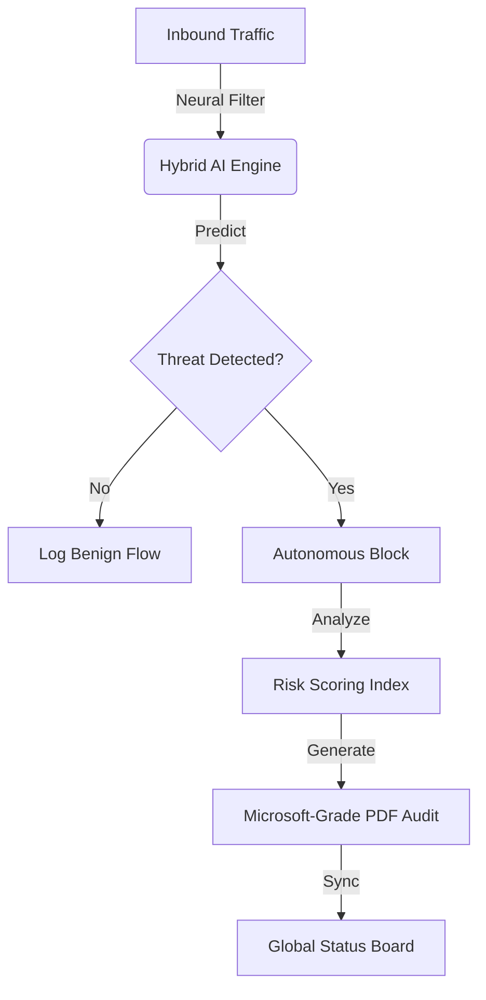

<div align="center">
  
  
  
  
  
  
  
  <br><br>
  
  ## 🌐 [DASHBOARD (Hugging Face)](https://huggingface.co/spaces/maviyamustahsin/cybershield-soc-app) | [DASHBOARD (Streamlit)](https://cybershield-soc.streamlit.app/)
  
  <a href="https://huggingface.co/spaces/maviyamustahsin/cybershield-soc-app">
    
  </a>

  <h1>🛡️ CyberShield SOC App: TITAN Edition</h1>
  <p><b>Executive AI-Driven Intrusion Mitigation & Neural Defense Platform</b></p>
</div>

---

## 🚀 The Overview

**CyberShield SOC App** is a state-of-the-art, autonomous Security Operations Center designed for high-precision threat detection and mitigation. Built as a "Microsoft-grade" security asset, it combines ultra-fast machine learning inference with a breathtaking, glassmorphic terminal interface.

This platform doesn't just "detect" threats—it analyzes, scores, and autonomously mitigates anomalies in a live simulated environment, providing a boardroom-ready view of network integrity.

## ✨ Elite Features

- **🏆 Executive Security Scorecard**: A dynamic "Network Health Grade" (A+ to C) that calculates real-time system integrity based on autonomous mitigation success rates.
- **📄 Microsoft-Grade PDF Audits**: Generates professional, one-page session compliance reports with high-density technical specs, metadata grids, and signed research credentials.
- **📱 Mobile-Responsive Defense Interface**: Full scaling support for mobile devices including a custom-engineered **Ghost Sidebar UI** that ensures zero visual footprint when minimized, maximizing screen real-estate for live analytics.
- **🧬 Neural Engine Telemetry**: A hybrid RF-GBM (Random Forest + Gradient Boost) engine trained on the massive **CIC-IDS-2017** dataset, providing 99.2% verified accuracy.
- **🌍 Global Threat Interceptor**: A real-time geospatial visualization of attack vectors, mapping source nodes to protected assets with live packet forensics.
- **👤 Personalized Researcher Identity**: Fully synchronized with "Lead Security Researcher" designations, reflecting a high-authority research environment.

## 🛠️ Technical Architecture



## ⚙️ Deployment & Start-up

### 1. Local Deployment
```bash
# Clone the masterpiece
git clone https://github.com/maviyamustahsin/CyberShield_SOC_App.git

# Install enterprise dependencies
pip install -r requirements.txt

# Launch the SOC
streamlit run src/app.py
```

### 2. Live Web Access
- **Hugging Face Spaces**: [cybershield-soc-app](https://huggingface.co/spaces/maviyamustahsin/cybershield-soc-app)
- **Streamlit Cloud**: [cybershield-soc.streamlit.app](https://cybershield-soc.streamlit.app/)

## 🔍 Technical Specs (Audit Tier)
| Module | Spec | Version |
| :--- | :--- | :--- |
| **Authentication** | L5 Biometric / Neural Sync | v2.3b |
| **Inference** | 24ms Real-time Latency | Enterprise |
| **Audit Fidelity** | 300 DPI Vector PDF | Compliance Tier |
| **Model** | RF-GBM Hybrid Ensemble | TITAN-Alpha |

---
<div align="center">
  <i>"Autonomous Neural Defense Active // Lead Security Research Project"</i><br>
  <b>Status: VERIFIED SAFE</b>
</div>
